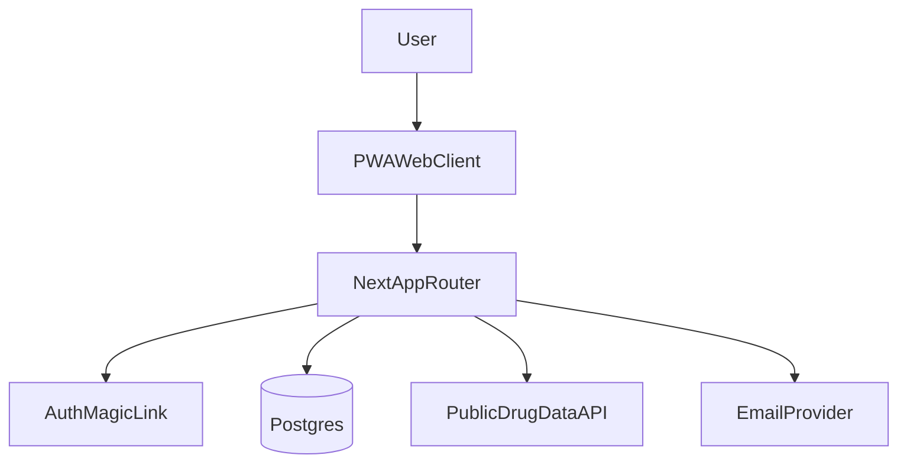
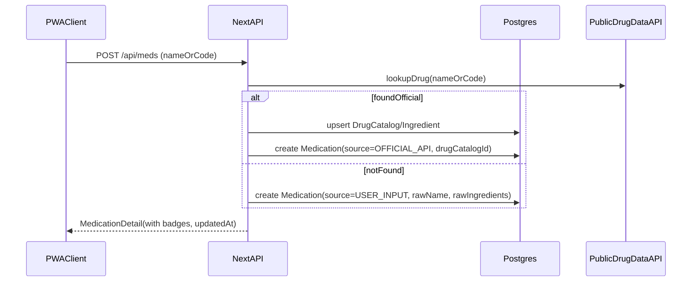
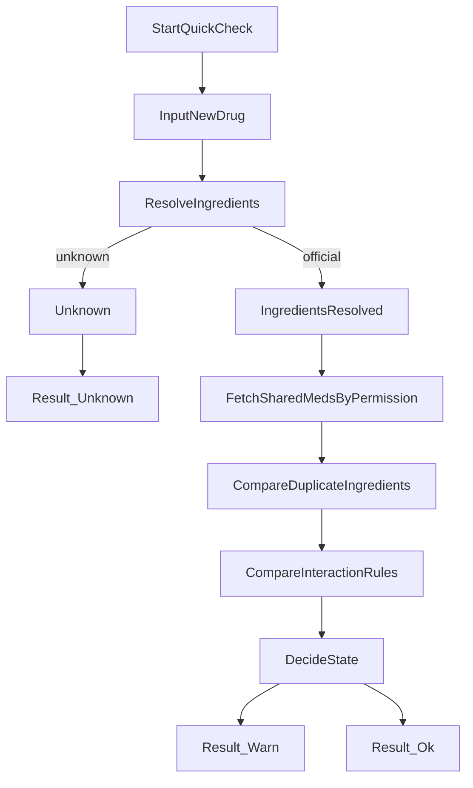

## 코드 아키텍처 (Vercel 배포 / 웹앱+PWA) — 가족 약 복용 안전 관리 서비스

> 기준 문서: `기획안.md`, `wireframe.md`, `design-guide.md`  
> 목표: 개발을 몰라도 이 문서만 따라가면 **MVP를 끝까지 구현/배포**할 수 있게 “기술 선택 + 폴더 구조 + DB/권한 + API + 배포”를 한 번에 정의합니다.

---

## 0) 제품 원칙 → 코드 원칙 매핑 (Non-negotiables)

### 핵심 제품 원칙(기획) 요약
- **Info-only**: 의료 판단/처방이 아닌 “가능성 + 근거 + 다음 행동(약사/의사 상담)”만 제공
- **선택적 공유(Opt-in)**: 기본 비공개, 사용자 동의로만 공유/철회
- **최소 데이터**: 실명/병명/진단/복용 이유 미수집(닉네임 중심)
- **확인불가 처리**: 데이터가 없으면 “확인불가”로 강등 + 행동 가이드 제공
- **근거/출처 표기**: 성분/주의 근거와 출처/갱신일 표시

### 코드에서 반드시 지켜야 할 원칙(구현 규칙)
- **R1. 데이터 최소화**: DB/로그/분석에 병명·진단·복용 목적 컬럼을 만들지 않는다.
- **R2. 비노출 강제**: 공유되지 않은 약은 “리스트/검색/카운트/존재 여부”가 타인에게 보이지 않게 **쿼리 레벨에서 차단**한다.
- **R3. 3단계 결과 상태 고정**: `주의필요` / `이슈없음(현재정보기준)` / `확인불가`만 사용(문구는 바꿔도 상태는 고정).
- **R4. 외부 데이터 신뢰 표기**: `출처`, `갱신일`, `확인가능범위`를 UI에서 항상 표시한다.
- **R5. 안전 고지 고정**: 결과 화면에 “의료 조언 아님 + 복용/구매 전 약사/의사 상담”을 고정 노출한다.

---

## 1) 기술 스택(최신 안정화 버전) & 선택 이유

### 프레임워크/언어
- **Next.js 16.1.4** (App Router)
  - Vercel 최적화(SSR/ISR/Route Handlers/이미지 최적화/Edge 옵션)
- **React 19.2.3**, **react-dom 19.2.3**
- **TypeScript 5.9.3**

### UI/스타일
- **Tailwind CSS 4.1.18**
- **shadcn/ui**(컴포넌트 프리셋): 접근성/일관성 확보
- 디자인 토큰은 `design-guide.md`의 컬러/타이포/여백 규칙을 그대로 반영

### 데이터/검증
- **Postgres**(관리형 권장)
- ORM: **Prisma 7.3.0** (스키마/마이그레이션/타입 안정성)
  - 대안: Drizzle ORM 0.45.1 (원하면 전환 가능하지만 MVP는 Prisma로 고정)
- 스키마 검증: **zod 4.3.5**

### 인증(이메일 매직링크)
- **next-auth 4.24.13**(Auth.js 계열)
  - 구현 단순, 세션/콜백/보안 표준화
- 이메일 발송: Resend(또는 동급 SMTP/메일 API)

### 운영/품질(권장)
- 에러 추적: Sentry(선택)
- 속도/지표: Vercel Analytics(선택)
- 레이트 리밋: Upstash Redis(선택, 추후)

### 버전 고정 정책(중요)
- `package.json`에는 위 버전을 **정확히 고정(pin)** 한다.
- 업그레이드는 “분기별 1회”처럼 리듬을 정하고, CI에서 빌드/타입체크로 안전성 검증 후 적용한다.

---

## 2) 시스템 컨텍스트(전체 구성)



### 구성 요소 설명
- **PWAWebClient**: 모바일 우선 UI(홈/내약/가족/대신약) + manifest(홈화면 추가)
- **NextAppRouter**: 페이지 렌더링 + Route Handlers(API)
- **AuthMagicLink**: 이메일 로그인(매직링크) + 세션 관리
- **Postgres**: 사용자/그룹/공유/약/캐시/감사로그 저장
- **PublicDrugDataAPI**: 식약처/공공데이터 기반 약/성분/주의 정보 조회(서버에서만 호출)
- **EmailProvider**: 매직링크 메일 발송

---

## 3) Vercel 런타임/배포 아키텍처

### 런타임 선택 기준
- **Node 런타임(기본)**: DB(Prisma) 접근, 외부 API 호출, 메일 발송 등 대부분의 서버 로직
- **Edge 런타임(선택)**: 초저지연이 꼭 필요한 단순 읽기 API/리다이렉트 정도만(초기엔 사용하지 않아도 됨)

### Node 버전(권장 고정)
- **Node.js 22.x**로 고정(로컬/CI/Vercel 동일)
  - 이 프로젝트 작업 환경 확인: `node v22.22.0`
- 방법
  - `package.json`의 `engines.node`를 `22.x`로 고정
  - Vercel Project Settings에서 Node Version을 22로 지정

### 캐싱 전략(요약)
- 약 데이터(공개 API 응답)는 서버에서 **캐시 테이블에 저장**하고 TTL/갱신일을 관리
- Quick Check는 “현재 DB에 있는 최신 캐시”를 우선 사용하고, 필요 시 백그라운드 갱신

### 배치/크론
- Vercel Cron(또는 외부 스케줄러)로 약 데이터 캐시 갱신(일/주 단위)
  - 권장 엔드포인트: `GET /api/cron/drug-catalog-sync?token=...`
  - 크론 요청은 비공개 토큰으로 보호(환경변수로 관리)

---

## 4) 권장 폴더 구조(Next.js App Router)

```text
src/
  app/
    (routes)/
      page.tsx
      my-meds/
      family/
      quick-check/
      settings/
    api/
      auth/[...nextauth]/route.ts
      meds/route.ts
      groups/route.ts
      invites/route.ts
      quick-check/route.ts
      reports/route.ts
    layout.tsx
    globals.css
  components/
    ui/                # shadcn/ui 생성물
    common/
    meds/
    family/
    quick/
  features/
    meds/
    family/
    quickCheck/
    auth/
  server/
    auth/
    permissions/
    services/
    rateLimit/
  db/
    prisma/
      schema.prisma
    migrations/
  lib/
    env.ts
    fetcher.ts
    normalize/
    constants/
```

### 구조 원칙
- **UI**는 `components/`에, **도메인 로직**은 `features/`와 `server/`에 둔다.
- “권한/비노출” 규칙은 흩어지면 위험하므로 `server/permissions/`로 집중시킨다.

---

## 5) 핵심 도메인 모델(DB 스키마 초안)

> 목표: 기획의 “약 단위 공유 + 가족 그룹 + 초대 + 조회 이력(감사) + 오류 신고”를 모두 수용한다.

### 엔티티(개념) 목록
- **User / Profile**
  - `User`: 로그인 식별(이메일)
  - `Profile`: 닉네임/프로필 이미지 등(최소 정보)
- **FamilyGroup / GroupMember**
  - 가족 그룹 1개에 다수 구성원
- **Invite**
  - 초대 코드/링크(만료/재발급)
- **Medication**
  - 사용자가 등록한 “내 약”
  - 출처: `OFFICIAL_API` 또는 `USER_INPUT`
- **MedicationShare**
  - “약 단위 공유” 매핑(공유 대상 멤버 단위)
- **DrugCatalog / Ingredient / DrugAlias**
  - 공개 데이터 캐시(약, 성분, 동의어/검색용)
- **InteractionRule**
  - (가능하면) 병용금기/주의 규칙(라이선스/커버리지에 따라 `확인불가` 처리 포함)
- **ReportIssue**
  - 데이터 오류 신고/문의
- **AccessLog**
  - 누가 누구의 어떤 정보를 조회했는지(신뢰 강화)

### 스키마 설계 핵심(중요)
- **공유되지 않은 약은 존재 자체가 노출되면 안 됨**
  - 따라서 “가족이 보는 약 목록”은 항상 `MedicationShare`를 통해서만 조회한다.
  - 절대로 “그룹의 모든 약” 같은 쿼리를 만들지 않는다.

### Prisma 스키마(초안, MVP용)

```prisma
// schema.prisma (요약 초안)
// - 실제 구현 시 provider/url, generator, enum/인덱스는 프로젝트 상황에 맞게 조정

enum MedicationSource {
  OFFICIAL_API
  USER_INPUT
}

enum ReportType {
  DRUG_NAME
  INGREDIENTS
  WARNINGS
  OTHER
}

enum ReportStatus {
  OPEN
  TRIAGED
  RESOLVED
  REJECTED
}

enum AccessAction {
  VIEW_SHARED_MED
  VIEW_QUICK_CHECK_RESULT
}

model User {
  id            String   @id @default(cuid())
  email         String   @unique
  emailVerified DateTime?
  createdAt     DateTime @default(now())
  updatedAt     DateTime @updatedAt

  profile       Profile?
  memberships   GroupMember[]
  meds          Medication[]
  createdInvites Invite[] @relation("InviteCreatedBy")
  reports       ReportIssue[]
  accessLogs    AccessLog[]
}

model Profile {
  id        String   @id @default(cuid())
  userId    String   @unique
  nickname  String
  imageUrl  String?
  createdAt DateTime @default(now())
  updatedAt DateTime @updatedAt

  user      User     @relation(fields: [userId], references: [id], onDelete: Cascade)
}

model FamilyGroup {
  id          String   @id @default(cuid())
  name        String
  ownerUserId String
  createdAt   DateTime @default(now())
  updatedAt   DateTime @updatedAt

  owner       User         @relation(fields: [ownerUserId], references: [id])
  members     GroupMember[]
  invites     Invite[]

  @@index([ownerUserId])
}

model GroupMember {
  id        String   @id @default(cuid())
  groupId   String
  userId    String
  joinedAt  DateTime @default(now())
  leftAt    DateTime?

  group     FamilyGroup @relation(fields: [groupId], references: [id], onDelete: Cascade)
  user      User        @relation(fields: [userId], references: [id], onDelete: Cascade)
  sharedToMe MedicationShare[] @relation("SharedToMember")

  @@unique([groupId, userId])
  @@index([userId])
  @@index([groupId])
}

model Invite {
  id             String   @id @default(cuid())
  groupId        String
  createdByUserId String
  tokenHash      String   @unique
  expiresAt      DateTime
  revokedAt      DateTime?
  createdAt      DateTime @default(now())

  group          FamilyGroup @relation(fields: [groupId], references: [id], onDelete: Cascade)
  createdBy      User        @relation("InviteCreatedBy", fields: [createdByUserId], references: [id], onDelete: Cascade)

  @@index([groupId])
  @@index([createdByUserId])
}

model Medication {
  id            String   @id @default(cuid())
  ownerUserId   String
  displayName   String
  source        MedicationSource
  drugCatalogId String?
  userInputIngredientsText String? // USER_INPUT일 때만 사용(원문)
  createdAt     DateTime @default(now())
  updatedAt     DateTime @updatedAt

  owner         User      @relation(fields: [ownerUserId], references: [id], onDelete: Cascade)
  drugCatalog   DrugCatalog? @relation(fields: [drugCatalogId], references: [id], onDelete: SetNull)
  shares        MedicationShare[]

  @@index([ownerUserId])
  @@index([drugCatalogId])
}

model MedicationShare {
  id               String   @id @default(cuid())
  medicationId     String
  sharedToMemberId String
  createdAt        DateTime @default(now())
  revokedAt        DateTime?

  medication       Medication  @relation(fields: [medicationId], references: [id], onDelete: Cascade)
  sharedToMember   GroupMember @relation("SharedToMember", fields: [sharedToMemberId], references: [id], onDelete: Cascade)

  @@unique([medicationId, sharedToMemberId])
  @@index([sharedToMemberId])
}

model DrugCatalog {
  id          String   @id @default(cuid())
  productCode String?  @unique
  name        String
  sourceName  String   // 예: MFDS_NDRUG
  sourceUpdatedAt DateTime?
  fetchedAt   DateTime @default(now())
  createdAt   DateTime @default(now())
  updatedAt   DateTime @updatedAt

  ingredients DrugCatalogIngredient[]
  aliases     DrugAlias[]
}

model Ingredient {
  id            String @id @default(cuid())
  name          String
  normalizedKey String @unique

  inDrugs       DrugCatalogIngredient[]
}

model DrugCatalogIngredient {
  id           String @id @default(cuid())
  drugCatalogId String
  ingredientId String
  amountText   String?

  drug         DrugCatalog @relation(fields: [drugCatalogId], references: [id], onDelete: Cascade)
  ingredient   Ingredient  @relation(fields: [ingredientId], references: [id], onDelete: Cascade)

  @@unique([drugCatalogId, ingredientId])
  @@index([ingredientId])
}

model DrugAlias {
  id             String @id @default(cuid())
  drugCatalogId  String
  alias          String
  normalizedAlias String

  drug           DrugCatalog @relation(fields: [drugCatalogId], references: [id], onDelete: Cascade)

  @@index([normalizedAlias])
}

model InteractionRule {
  id            String @id @default(cuid())
  ingredientAId String
  ingredientBId String
  severity      String // 예: CONTRAINDICATED / CAUTION / INFO
  evidenceSource String
  note          String?
  active        Boolean @default(true)

  @@unique([ingredientAId, ingredientBId])
  @@index([active])
}

model ReportIssue {
  id            String @id @default(cuid())
  reporterUserId String
  reportType    ReportType
  message       String
  medicationId  String?
  drugCatalogId String?
  attachmentUrl String?
  status        ReportStatus @default(OPEN)
  createdAt     DateTime @default(now())
  updatedAt     DateTime @updatedAt

  reporter      User @relation(fields: [reporterUserId], references: [id], onDelete: Cascade)

  @@index([status])
  @@index([reporterUserId])
}

model AccessLog {
  id            String @id @default(cuid())
  viewerUserId  String
  targetMemberId String
  action        AccessAction
  medicationId  String?
  createdAt     DateTime @default(now())

  viewer        User @relation(fields: [viewerUserId], references: [id], onDelete: Cascade)

  @@index([viewerUserId])
  @@index([targetMemberId])
  @@index([createdAt])
}
```

#### 설계 메모(현실적인 MVP 타협)
- `USER_INPUT` 약은 성분 정규화가 어렵기 때문에 MVP에서는 `userInputIngredientsText`를 우선 저장하고, Quick Check에서는 “확인불가”로 강등할 수 있게 설계한다.
- 추후 확장 시: `MedicationUserInputIngredient` 같은 테이블을 추가해 사용자 입력 성분을 정규화/매핑할 수 있다.

---

## 6) 권한 모델(Opt-in + 비노출)

### 역할/관계
- 그룹 내 멤버는 기본적으로 동등(가족 가정)
- 그룹 관리(초대/만료/재발급)는 MVP에서 “그룹 소유자(creator)”만 하도록 단순화 권장

### 권한 규칙(필수)
- **P1. 약 조회**
  - 본인 약: `Medication.ownerUserId == session.userId`
  - 타인 약: `MedicationShare.sharedToMemberId == viewerMemberId` 로만 접근 가능
- **P2. 공유 철회**
  - 공유를 만든 사람(약의 owner)만 가능
- **P3. “존재 비노출”**
  - 타인에게 공유되지 않은 약은:
    - 리스트에 안 보임
    - 검색 결과에 안 나옴
    - “총 N개” 카운트에도 포함되면 안 됨
  - 즉, “가족 약” 화면은 **항상 공유 매핑을 기준으로 구성**한다.
- **P4. 감사 로그**
  - 타인 공유 약을 조회하면 `AccessLog`에 기록(최소 필드: viewer, targetMember, action, timestamp)

### “존재 비노출”을 실제로 보장하는 구현 패턴(중요)
- **패턴 A: 가족 약 목록은 항상 Share 중심으로 조회**
  - 가족 화면(구성원별 공유 약)은 `MedicationShare` → `Medication` 조인으로만 만든다.
  - 즉, “그 사람이 가진 약 전체”를 조회한 뒤 필터링하는 방식을 금지한다(그 순간 메타 누출 위험).
- **패턴 B: 카운트/검색도 Share 중심**
  - “엄마가 공유한 약 N개”의 N은 `MedicationShare`에서만 카운트한다.
  - “가족 약 검색”도 `MedicationShare`를 기준으로 검색 범위를 제한한다.
- **패턴 C: Route Handler 공통 가드**
  - 모든 API는 다음 순서로 검사한다:
    - `requireSession()`
    - 요청된 리소스가 **내 것인지**, 아니면 **공유를 통해 접근 가능한지**를 확인
    - 둘 다 아니면 404(권한 없음이 아니라 “없는 것처럼” 응답: 존재 비노출)
- **패턴 D: 404로 응답하기**
  - 공유되지 않은 약에 대한 접근은 403보다 **404**가 안전하다(존재 여부를 숨김).

---

## 7) 주요 유저 플로우별 데이터 흐름

### 7.1 약 등록(검색/직접입력)



### 7.2 가족 초대(코드/링크, 만료/재발급)
- 초대 토큰은 **랜덤 생성 → 해시 저장**(원문 저장 금지)
- 초대 링크의 원문 토큰은 DB에 저장하지 않고, 검증 시 해시로 비교한다.

### 7.3 공유 설정(약 단위)
- `MedicationShare`를 `(medicationId, sharedToMemberId)`로 생성/삭제
- 기본값은 항상 OFF

### 7.4 대신 약 사주기(Quick Check) — 핵심



#### Quick Check 상태 결정 규칙(기획 반영)
- **확인불가**
  - 입력 약이 데이터에 없거나 성분을 확정할 수 없음
  - 비교 대상(가족 공유 약)이 없음/권한 없음으로 비교가 불충분한데 사용자가 “내 약만 비교”도 꺼둔 경우
- **주의 필요**
  - 중복 성분 발견(같은 성분이 일정 기준 이상 겹침)
  - 상호작용 규칙(병용금기/주의) 매칭(가능한 범위 내)
- **현재 정보로 큰 이슈 없음**
  - 확인 가능한 범위에서 중복/규칙 매칭이 없음
  - 단, 개인 상태에 따라 달라질 수 있음을 고지

---

## 8) API 설계(Next.js Route Handlers)

> 원칙: 외부 API 키/DB 접근이 있으므로 **서버에서만 처리**. 클라이언트는 Route Handler만 호출.

### 인증
- `GET/POST /api/auth/*`: next-auth 라우트

### 약
- `GET /api/meds`
  - 본인 약 목록(필터: 공유됨/비공개/확인불가)
- `POST /api/meds`
  - 약 등록(검색/직접입력)
- `GET /api/meds/:id`
  - 본인 약 상세(또는 공유 받은 경우만)
- `POST /api/meds/:id/share`
  - 공유 대상 멤버 목록 업데이트(약 단위)

### 가족/초대
- `GET /api/groups`
- `POST /api/groups` (그룹 생성)
- `POST /api/invites` (초대 생성/재발급)
- `POST /api/invites/accept` (초대 수락)

### Quick Check
- `POST /api/quick-check`
  - 입력: 후보 약(이름/코드/직접입력 성분)
  - 출력: 상태(3단계) + 근거(겹친 성분/규칙 키워드) + 행동 가이드 텍스트

### API 계약 예시(문서형 스키마)

#### `POST /api/quick-check` 요청/응답(예시)
- Request(JSON)

```json
{
  "input": {
    "type": "OFFICIAL_QUERY",
    "query": "타이레놀"
  },
  "scope": "ME_AND_SHARED_FAMILY"
}
```

- Response(JSON)

```json
{
  "state": "WARN",
  "reasons": {
    "duplicateIngredients": ["acetaminophen"],
    "interactionHits": [
      {
        "severity": "CAUTION",
        "ingredients": ["ingredientA", "ingredientB"],
        "evidenceSource": "DUR_REFERENCE",
        "note": "가능성 안내"
      }
    ],
    "unknownReasons": []
  },
  "askPharmacistMessage": "현재 ○○ 성분/약을 복용 중인데, 이 약과 같이 복용해도 되는지 확인 부탁드려요.",
  "dataFootnote": "본 서비스는 의료 조언이 아닌 참고 정보이며, 복용/구매 전 약사·의사와 상담하세요."
}
```

#### `POST /api/meds` 요청(예시)
- 공식 검색 기반

```json
{
  "type": "OFFICIAL_QUERY",
  "query": "약 이름 또는 제품 코드"
}
```

- 직접 입력 기반(확인불가로 강등될 수 있음)

```json
{
  "type": "USER_INPUT",
  "displayName": "해외 직구 감기약",
  "ingredientsText": "성분표 원문(모르면 비워도 됨)"
}
```

### API 에러/상태 코드 정책
- **401**: 로그인 안 됨
- **404**: 리소스가 없거나(또는) 접근 권한이 없음(존재 비노출 목적)
- **422**: 입력 검증 실패(zod)
- **429**: 레이트 리밋
- **500**: 서버 오류(외부 API/DB 포함)

### 권장 서버 레이어링(안전한 분리)
- Route Handler(`src/app/api/*`)는 “입력 검증/세션 확인/응답”만 담당
- 비즈니스 로직은 `src/server/services/*`에 두고 재사용
- 권한 판단은 `src/server/permissions/*`에서만 수행(분산 금지)

### 신고/문의
- `POST /api/reports`
  - 약 데이터 오류 신고(유형/내용/스크린샷 URL 등)

---

## 9) PWA/오프라인(최소 전략, MVP 기준)

### MVP에서 반드시 할 것(가벼운 PWA)
- Web App Manifest 제공(홈화면 추가, 앱 이름/아이콘)
- “대신 약” 화면에서 **저신호 안내 배너** 제공(UX)

#### Next.js(App Router)에서 필요한 파일(권장)
- `src/app/manifest.ts` (또는 `manifest.webmanifest` 제공)
- `src/app/icon.png`, `src/app/apple-icon.png` (아이콘)
- `src/app/layout.tsx`에서 `metadata`/`viewport`로 PWA 친화 설정

### 오프라인 캐싱(선택, 하고 싶을 때만)
- 라이브러리: **@serwist/next 9.5.0**(권장)
  - 목적: “최근 조회한 약 상세/비교 결과” 같은 **읽기 전용** 데이터 캐시
  - 금지: 캐시된 내용이 “의료 판정”처럼 보이게 만들면 안 됨(항상 Info-only 고지 유지)

### MVP에서 권장(가능하면)
- “최근 조회한 약 상세/비교 결과”를 로컬에 캐시(읽기 전용)
  - 기술 후보: IndexedDB(브라우저 내장) 또는 단순 캐시 스토리지
- 오프라인일 때는:
  - “최근 데이터로 표시 중”을 명확히 노출
  - “확정 판정 아님 + 약사 문의” CTA는 유지

---

## 10) 보안/프라이버시 체크리스트(필수)

### 개인정보/의료 정보
- 병명/진단/복용 이유 입력란 및 저장 컬럼 금지
- 프로필은 닉네임/이미지만(선택)

### 초대 링크 보안
- 토큰 원문 DB 저장 금지(해시만 저장)
- TTL(예: 24시간) + 재발급(기존 즉시 만료)

### 접근 제어
- Route Handler 진입 시 항상 `session.userId` 확인
- DB 쿼리에서 “공유 매핑 기반”으로만 타인 데이터 접근

### 악용 방지(권장)
- 로그인/초대/검색/quick-check에 레이트 리밋
- 초대 남발 방지(일/시간당 생성 제한)

---

## 11) 운영/관측(Observability)

### 운영 로그(권장)
- API 에러, 외부 API 실패율, 캐시 적중률, quick-check 호출량
- ReportIssue 처리 상태(접수/확인/반영/반려)

### 신뢰(감사 로그)
- 가족 공유 약 조회 시 `AccessLog` 기록
- 설정 화면에서 “조회 이력” 노출(Phase 1에 포함하거나 Phase 2로 미룰지 결정 가능)

---

## 12) 환경변수/로컬 실행/배포 절차(개발자가 없어도 따라가기)

### 환경변수(예시)
- **필수**
  - `DATABASE_URL`
  - `NEXTAUTH_SECRET` (또는 `AUTH_SECRET`)
  - `NEXTAUTH_URL` (또는 `AUTH_URL`)
  - `EMAIL_FROM`
  - `RESEND_API_KEY` (또는 SMTP 자격)
- **약 데이터(선택/필수는 출처에 따라 다름)**
  - `MFDS_API_KEY` (식약처/공공데이터 키)
- **운영(선택)**
  - `SENTRY_DSN`
  - `UPSTASH_REDIS_REST_URL`, `UPSTASH_REDIS_REST_TOKEN`

### Vercel 배포 순서(요약)
1. GitHub 저장소 연결 → Vercel Import
2. Vercel Project Settings에서 **Node Version 22** 지정
3. Vercel 대시보드에서 Environment Variables 등록
4. Postgres 연결(관리형 선택) → `DATABASE_URL` 설정
5. 배포(Preview → Production)
6. (선택) Vercel Cron 설정(약 데이터 캐시 갱신)

### Vercel 빌드 설정(권장)
- Install Command: `pnpm install --frozen-lockfile`
- Build Command: `pnpm build`
- Output: Next.js 자동 감지(추가 설정 불필요)

### 크론 보호(권장)
- `CRON_SECRET` 환경변수를 만들고, 크론 엔드포인트는 `?token=${CRON_SECRET}` 같은 방식으로 보호한다.
- 토큰이 없거나 틀리면 404 또는 401을 반환한다(외부 노출 최소화).

---

## 13) “빠지면 안 되는 UI 문구(고정 카피)”
- “본 서비스는 의료 조언이 아닌 참고 정보예요. 복용/구매 전 약사·의사와 상담하세요.”
- “확인불가: 데이터에 없어 확인이 어려워요. 제품명/성분표를 약사에게 보여주세요.”

---

## 14) MVP 범위 체크리스트(기획안 v1.0 대응)
- 약 등록(검색/직접입력) + 출처/갱신일 + 확인불가 라벨
- 가족 그룹 생성/초대(코드/링크, 만료/재발급)
- 약 단위 공유(Opt-in) + 비노출 강제
- 대신 약 사주기(Quick Check) 10~20초 플로우
- 결과 3단계(주의 필요/이슈 없음/확인불가) + 근거 + 약사 문의 가이드
- 법적/안전 고지 + 데이터 출처 정책 화면
- 오류 신고/문의

