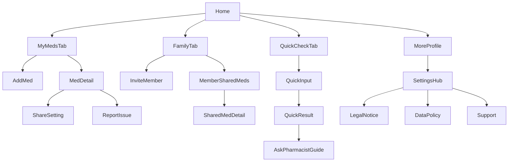

## 가족 약 복용 안전 관리 서비스 — 모바일 앱 Wireframe (Lo-fi)

> 본 문서는 `기획안.md(v1.0, 2026-01-22)`를 기반으로, **모바일 앱 화면 구조**에 맞춘 저충실도(Lo-fi) 와이어프레임입니다.  
> 핵심 원칙: **Info-only(의료 판단 아님)** / **선택적 공유(Opt-in)** / **최소 데이터(병명·진단 수집/공유 없음)** / **근거·출처·확인불가 처리 명확화**

---

### 1) 앱 내비게이션(확정)

- **하단 탭(4)**: 홈 / 내 약 / 가족 / 대신 약
- **설정 진입**: 상단 프로필/더보기(⋯) → 설정/안내 허브

#### 공통 상단바(예시)

- 좌측: 화면 제목(또는 뒤로가기)
- 우측: 프로필(또는 ⋯ 더보기), 검색(필요 시)

---

### 2) 화면 목록(IA)

#### 탭 화면

- **홈(Home)**
- **내 약(My Meds)**
  - 내 약 목록
  - 약 등록(검색/직접입력)
  - 약 상세
  - 공유 설정(약 단위)
- **가족(Family)**
  - 가족 그룹/구성원
  - 가족별 공유 약 목록
  - 가족 초대(코드/링크)
- **대신 약(Quick Check)**
  - 약 입력(검색/스캔)
  - 비교 결과(중복/상호작용 가능성 + 근거 + 행동 가이드)

#### 더보기/프로필(탭 외)

- **설정/안내 허브**
- **개인정보/약관/고지**
- **데이터 출처/정확도 안내**
- **문의/신고**
  - 약 정보 오류 신고(약 상세에서 진입 가능)

---

### 3) 주요 사용자 흐름(요약 맵)



---

### 4) 공통 컴포넌트 정의

- **배지/라벨**
  - `공개 데이터 기반` + `갱신일 YYYY-MM-DD`
  - `사용자 입력(검증 전)` 또는 `확인불가`
  - `공유됨`(약 단위) / `비공개`
- **결과 상태(3단계)** *(DUR 레퍼런스 기반 “가능성 안내” 정책)*  
  - **주의 필요**: 중복/병용주의 근거가 발견됨(또는 가능성 높음) → 약사/의사 상담 CTA 고정  
  - **현재 정보로는 큰 이슈 없음**: 확인 가능한 범위에서 근거 없음 → 단, 개인 상태에 따라 달라질 수 있음 고지  
  - **확인불가**: 데이터 미포함/표준화 실패/사용자 입력 약 → 제품명/성분표 제시하여 약사 문의 안내
- **공통 고지(짧은 버전)**
  - “본 서비스는 의료 조언이 아닌 정보 제공이며, 복용/구매 전 약사·의사와 상담하세요.”

---

## 5) 화면별 와이어프레임

> 표기 규칙: `[버튼]`, `(링크)`, `{상태}`, `ⓘ`(정보/고지), `CTA:`(핵심 행동)

---

### 5.1 홈(Home)

#### 목적
- 내 약/가족/대신 약 사주기 모드로 **빠르게 진입**한다.

#### 레이아웃(Lo-fi)

```
┌──────────────────────────────┐
│ 홈                     [프로필] │
├──────────────────────────────┤
│ ⓘ 의료 판단이 아닌 참고 정보예요. │
│                              │
│ [대신 약 사주기(빠른 확인)]     │  ← CTA
│                              │
│ 내 약 요약                    │
│ - 등록: N개                   │
│ - 최근 등록: 약A / 약B         │
│ [내 약 보러가기]               │
│                              │
│ 가족 그룹                      │
│ - 우리 가족 (구성원 M명)        │
│ [가족 보러가기]                │
│                              │
└──────────────────────────────┘
 하단탭: [홈] [내 약] [가족] [대신 약]
```

#### 핵심 컴포넌트
- 빠른 CTA: **대신 약 사주기**
- 카드: 내 약 요약 / 가족 요약

#### 상태
- `{Empty}`: 내 약 0개 → “약을 등록해보세요” + `[약 등록]`
- `{Empty}`: 가족 그룹 없음 → “가족을 초대해 선택 공유를 시작하세요” + `[가족 만들기/초대]`

#### 이동
- 홈 → 대신 약(Quick Check) / 내 약 / 가족 / 프로필·더보기(설정)

---

### 5.2 내 약 탭 — 내 약 목록(My Meds List)

#### 목적
- 내가 등록한 약을 **조회/검색**하고, 약 상세/공유 설정으로 이동한다.

#### 레이아웃

```
┌──────────────────────────────┐
│ 내 약                [검색] [⋯] │
├──────────────────────────────┤
│ [ + 약 등록 ]                   │  ← CTA
│                              │
│ (필터) 전체 | 공유됨 | 비공개 | 확인불가 │
│                              │
│ ┌ 약 카드 ───────────────────┐ │
│ │ 약명(표준/표시)             │ │
│ │ 주요 성분: ○○, △△           │ │
│ │ 배지: 공개 데이터/갱신일     │ │
│ │ 배지: 공유됨/비공개/확인불가 │ │
│ └───────────────────────────┘ │
│ ...                          │
└──────────────────────────────┘
 하단탭: [홈] [내 약] [가족] [대신 약]
```

#### 상태
- `{Empty}`: “등록된 약이 없어요” + `[약 등록]`
- `{Loading}` / `{Error}`: 목록 로딩 실패 시 재시도 + 오프라인 안내(캐시 가능 시 “최근 데이터 표시”)

#### 이동
- 내 약 목록 → 약 등록 / 약 상세 / (⋯) 더보기(설정/안내)

---

### 5.3 약 등록(Add Med)

#### 목적
- 약을 **검색 기반으로 빠르게 등록**하고, 표준 데이터가 없으면 **직접 입력(확인불가 라벨)**로 등록한다.

#### 레이아웃

```
┌──────────────────────────────┐
│ 약 등록               [취소]    │
├──────────────────────────────┤
│ [검색창: 약 이름 입력…]          │
│ 자동완성 결과                  │
│ - 약A(표준)                     │
│ - 약B(표준)                     │
│                              │
│ ─ 또는 ─                       │
│ [직접 입력으로 등록] (확인불가)  │
│                              │
│ ⓘ 병명/진단/복용 이유는 입력하지 않아요 │
└──────────────────────────────┘
```

#### 상태/예외
- `{NoResult}`: “일치하는 결과가 없어요” + `[직접 입력]`
- `{DirectInput}`: 제품명/성분표 입력 → 저장 시 `사용자 입력(검증 전)` 또는 `확인불가` 배지 부여

#### 이동
- 약 등록 완료 → 약 상세(등록된 약)

---

### 5.4 약 상세(Med Detail)

#### 목적
- 약의 성분/주의 요약을 보고, **공유 설정** 및 **오류 신고**를 수행한다.

#### 레이아웃

```
┌──────────────────────────────┐
│ 약 상세               [공유 설정] │  ← CTA
├──────────────────────────────┤
│ 약명(표준/표시)                │
│ 배지: 공개 데이터 기반 / 갱신일  │
│ 배지: 사용자 입력(검증 전)/확인불가 │
│                              │
│ 주요 성분                       │
│ - ○○ (함량 가능 시)              │
│ - △△                           │
│                              │
│ 주의사항 요약(짧게)              │
│ - 병용주의: ...                  │
│ - 연령/임부 주의(가능 범위 내)    │
│                              │
│ ⓘ 본 서비스는 의료 조언이 아니며… │
│                              │
│ (링크) 데이터 출처/정확도 안내     │
│ (버튼) 정보 오류 신고              │
└──────────────────────────────┘
```

#### 상태
- `{확인불가}`: “데이터에 없어 확인이 어려워요” + “제품명/성분표를 약사에게 보여주세요”
- `{부분 데이터}`: 성분은 있으나 주의사항 요약 없음 → “현재 출처에서 확인 가능한 범위가 제한됨”

#### 이동
- 약 상세 → 공유 설정 / 데이터 정책 / 신고

---

### 5.5 공유 설정(약 단위 Share Setting)

#### 목적
- “이 약을 **누구에게 공유할지**”를 약 단위로 선택한다(기본 OFF).

#### 레이아웃

```
┌──────────────────────────────┐
│ 공유 설정              [완료]    │
├──────────────────────────────┤
│ 약: 약A                        │
│ 공유 범위: 성분/주의사항만        │
│                              │
│ 공유할 가족 선택(Opt-in)        │
│ [ ] 엄마(구성원)                │
│ [ ] 아빠(구성원)                │
│ [ ] 배우자(구성원)              │
│                              │
│ ⓘ 공유되지 않은 약은 가족에게 “존재 자체”가 보이지 않아요 │
└──────────────────────────────┘
```

#### 상태
- `{NoFamily}`: 가족 그룹 없음 → “가족을 먼저 초대하세요” + `[가족 탭으로 이동]`

#### 이동
- 공유 설정 완료 → 약 상세

---

### 5.6 가족 탭(Family)

#### 목적
- 가족 그룹을 관리하고, 구성원별로 **공유된 약만** 확인한다.

#### 레이아웃(그룹/구성원)

```
┌──────────────────────────────┐
│ 가족                 [초대] [⋯] │  ← CTA(초대)
├──────────────────────────────┤
│ 우리 가족 (구성원 M명)          │
│                              │
│ 구성원                         │
│ - 엄마  > (공유된 약 N개)        │
│ - 아빠  > (공유된 약 K개)        │
│ - 나    > (내 공유 설정 관리)    │
│                              │
│ ⓘ 병명/진단 정보는 공유하지 않아요 │
└──────────────────────────────┘
```

#### 가족 구성원 상세(공유 약 목록)

```
┌──────────────────────────────┐
│ 엄마 — 공유된 약               │
├──────────────────────────────┤
│ 공유된 약 목록(허용 범위만)      │
│ - 약명 / 주요 성분 / 주의 요약   │
│ - 배지: 출처/갱신일(작게)        │
│                              │
│ ⓘ 공유되지 않은 약은 목록에 보이지 않아요 │
└──────────────────────────────┘
```

#### 상태
- `{EmptyGroup}`: 가족 없음 → “가족을 만들어 초대해보세요” + `[가족 만들기] [초대]`
- `{EmptyShared}`: 구성원에게 공유된 약 0개 → “아직 공유된 약이 없어요”

#### 이동
- 가족 탭 → 초대 / 구성원 상세 / (⋯) 더보기(설정)

---

### 5.7 가족 초대(Invite Member)

#### 목적
- 초대 링크/코드를 생성하고, 만료/재발급을 지원한다.

#### 레이아웃

```
┌──────────────────────────────┐
│ 가족 초대              [닫기]    │
├──────────────────────────────┤
│ 초대 코드: ABCD-1234           │
│ 유효기간: 24시간               │
│ [코드 복사] [링크 공유]          │
│                              │
│ (버튼) 코드 재발급(기존 만료)     │
│                              │
│ ⓘ 초대는 동의 기반이며, 언제든 그룹에서 나갈 수 있어요 │
└──────────────────────────────┘
```

#### 상태
- `{Expired}`: 만료됨 → `[재발급]`

---

### 5.8 대신 약 탭(Quick Check) — 약 입력(Quick Input)

#### 목적
- “구매/복용하려는 약”을 입력하고, 10~20초 내 결과로 이동한다(큰 글씨/큰 버튼).

#### 레이아웃

```
┌──────────────────────────────┐
│ 대신 약 사주기            [프로필] │
├──────────────────────────────┤
│ [검색창: 약 이름 입력…]          │
│ [스캔] (가능 시)                 │
│                              │
│ 비교 대상                       │
│ - 내 약 + (권한 있는) 가족 공유 약 │
│                              │
│ [비교 시작]                      │  ← CTA
└──────────────────────────────┘
```

#### 상태
- `{NoPermission}`: 가족 공유 데이터 없음 → “가족 공유 약이 없어요(또는 권한 없음)” + “내 약 기준으로만 비교합니다” 토글/안내
- `{Offline}`: “네트워크가 불안정해요. 최근 데이터로 비교할 수 있어요(가능 시).”

---

### 5.9 대신 약 탭 — 비교 결과(Quick Result)

#### 목적
- 중복/상호작용 **가능성**을 카드로 보여주고, 근거와 “약사에게 질문하기” 가이드를 제공한다.

#### 레이아웃(결과 카드)

```
┌──────────────────────────────┐
│ 비교 결과                [공유/복사] │
├──────────────────────────────┤
│ 결과 요약(3단계)               │
│ [상태 배지: 주의 필요/이슈 없음/확인불가] │
│                              │
│ 카드 1) 중복 성분 가능성        │
│ - 있음/없음/확인불가            │
│ - 근거: 겹치는 성분 ○○           │
│                              │
│ 카드 2) 병용 주의 가능성         │
│ - 있음/없음/확인불가            │
│ - 근거: 주의 키워드(병용주의 등) │
│                              │
│ [약사에게 질문하기]              │  ← CTA(고정)
│ ⓘ 확정 판정이 아니며, 복용/구매 전 약사·의사와 상담하세요 │
│                              │
│ (접기/펼치기) 비교에 사용된 약 목록 │
└──────────────────────────────┘
```

#### 행동 가이드(Ask Pharmacist Guide)

```
┌──────────────────────────────┐
│ 약사에게 이렇게 물어보세요        │
├──────────────────────────────┤
│ 체크리스트/문장 템플릿            │
│ - “현재 ○○ 성분/약을 복용 중인데, 이 약과 같이 복용해도 되나요?” │
│ - “겹칠 수 있는 성분이 ○○인데, 중복 복용 위험이 있나요?” │
│ - “임부/고령자/간·신장(해당 시) 주의가 필요한가요?” │
│                              │
│ [문구 복사] [약 목록 공유(선택)]  │
└──────────────────────────────┘
```

#### 상태
- `{확인불가}`: “데이터에 없는 제품” → “제품명/성분표를 약사에게 제시” 가이드 + 확인불가 이유 표시(예: 사용자 입력)
- `{Partial}`: 가족 데이터 접근 제한 → “공유된 범위에서만 비교” 고지

---

### 5.10 더보기/프로필 → 설정/안내 허브(Settings Hub)

#### 목적
- 정책/고지/출처/문의로 진입한다.

#### 레이아웃

```
┌──────────────────────────────┐
│ 설정/안내                      │
├──────────────────────────────┤
│ [개인정보/약관/고지]             │
│ [데이터 출처/정확도 안내]         │
│ [문의/신고]                     │
│                              │
│ (옵션) 접근 이력/보안 설정(확장)  │
└──────────────────────────────┘
```

---

### 5.11 개인정보/약관/고지(Legal Notice)

#### 목적
- 의료 비판정/응급 안내/면책 고지, 개인정보 최소 수집 원칙을 명확히 고지한다.

#### 레이아웃(요약 + 전문 링크)

```
┌──────────────────────────────┐
│ 개인정보/약관/고지               │
├──────────────────────────────┤
│ 핵심 고지(요약)                  │
│ - 본 서비스는 의료 조언/진단/처방이 아님 │
│ - 복용/구매 전 약사·의사 상담 권장 │
│ - 응급/이상반응 시 119/의료기관 안내 │
│                              │
│ (링크) 개인정보 처리방침(전문)     │
│ (링크) 서비스 이용약관(전문)       │
└──────────────────────────────┘
```

---

### 5.12 데이터 출처/정확도 안내(Data Policy)

#### 목적
- 출처 우선순위/갱신일/확인 가능 범위를 사용자에게 투명하게 제공한다.

#### 레이아웃

```
┌──────────────────────────────┐
│ 데이터 출처/정확도 안내           │
├──────────────────────────────┤
│ 출처 우선순위(국내)              │
│ 1) 의약품안전나라(식약처)          │
│ 2) 공공데이터포털/공공기관 데이터  │
│ 3) 사용자 입력(검증 전/확인불가)   │
│                              │
│ 확인불가란?                      │
│ - 데이터 미포함/표준화 실패/사용자 입력 등 │
│ - 다음 행동: 제품명/성분표를 약사에게 제시 │
└──────────────────────────────┘
```

---

### 5.13 문의/신고(Support / Report)

#### 목적
- 데이터 오류/문의 접수를 제공한다(약 상세에서도 진입).

#### 레이아웃

```
┌──────────────────────────────┐
│ 문의/신고                       │
├──────────────────────────────┤
│ [약 정보 오류 신고]              │
│ [기타 문의]                     │
│                              │
│ 신고 폼(예)                     │
│ - 대상 약 선택                  │
│ - 오류 유형(성분/주의/명칭/기타)  │
│ - 내용(텍스트)                  │
│ - 스크린샷/사진(선택)            │
│ [제출]                          │
└──────────────────────────────┘
```

---

## 6) 검토 포인트(추가 결정 필요 항목)

- **스캔/바코드 기능**: MVP에서 실제 지원 여부(미지원 시 UI는 “준비 중” 처리)
- **비교 범위 토글**: “내 약만 비교” vs “내 약 + 가족(권한)” 기본값 정책
- **공유 단위**: MVP는 “약 단위 공유” 고정(“내 약 전체 공유” 옵션은 추후)
- **접근 이력(감사 로그)**: 11장 언급 기능을 MVP에 포함할지 여부(설정/안내에 위치 가능)

